# 3rd-Party Libraries

Here we feature a selection of third-party libraries that build upon or complement ViZDoom, 
offering diverse environments and tools for reinforcement learning research and development.
1. [LevDoom](#levdoom)
2. [COOM](#coom)


## LevDoom

[LevDoom](https://github.com/TTomilin/LevDoom) is a benchmark for generalization in pixel-based deep reinforcement learning, 
offering environments with difficulty levels based on visual and gameplay modifications.


### Environments
LevDoom consists of 4 scenarios, each with 5 difficulty levels. 
The base environment of a scenario serves as Level 0. Higher levels are obtained by modifying the base environment.
Every extra alteration increases the difficulty level of the generalization task by one. 
Each modification falls into one of 8 categories.

| Modification     | Description                                            |
|------------------|--------------------------------------------------------|
| Textures         | Appearance of surrounding walls, ceilings and floors   |
| Obstacles        | Impassable obstructions to impede the agent's movement |
| Entity Size      | Size of enemies and obtainable items                   |
| Entity Type      | Different enemies and obtainable items                 |
| Entity Rendering | Rendering type of enemies and obtainable items         |
| Entity Speed     | Enemy speed                                            |
| Agent Height     | Vertical shift of the agent's view point               |


### Difficulty Levels
Combining modifications leads to increasingly higher levels of difficulty.

| Scenario          | Level 0                                                                           | Level 1                                                                               | Level 2                                                                                               | Level 3                                                                                                         | Level 4                                                                            |
|-------------------|-----------------------------------------------------------------------------------|---------------------------------------------------------------------------------------|-------------------------------------------------------------------------------------------------------|-----------------------------------------------------------------------------------------------------------------|------------------------------------------------------------------------------------|
| Defend the Center | 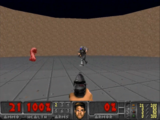 | 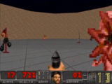        | 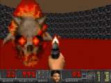 | 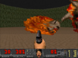 | 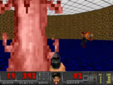 |
| Health Gathering  | 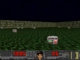  | 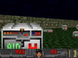 | 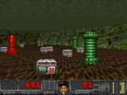  | 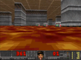         | 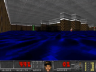  |
| Seek and Slay     | 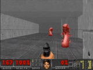     | 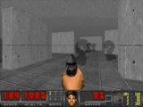         | 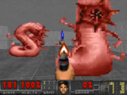     | 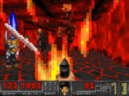            | 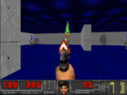     |
| Dodge Projectiles | 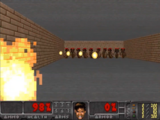 | 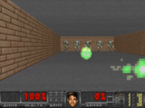      | 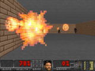                   | 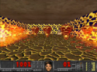    | 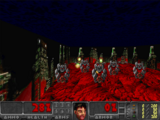 |

### Quick Start
LevDoom integrates with the Gymnasium API and is available through PyPi with `pip install LevDoom`. 
After installation, you can create an environment using the `make` function 
or environments of an entire level with the `make_level` function:

```python
import levdoom

train_env = levdoom.make('SeekAndSlayLevel1_3-v0')
test_envs = levdoom.make_level(levdoom.Scenario.SEEK_AND_SLAY, level=3)
```


For more details, please refer to the [CoG2022 paper](https://ieee-cog.org/2022/assets/papers/paper_30.pdf) and [GitHub repository](https://github.com/TTomilin/LevDoom).


## COOM
COOM is a Continual Learning benchmark for embodied pixel-based RL, consisting of task sequences 
in visually distinct 3D environments with diverse objectives and egocentric perception. COOM is 
designed for task-incremental learning, in which task boundaries are clearly defined.

<p align="center">
  
  
</p>


### Environments

COOM contains 8 scenarios. Every scenario has at least 2 environments: `default` and `hard`.

| Scenario         | Success Metric    | Task Description                                                                           | Screenshot                                                                  |
|------------------|-------------------|--------------------------------------------------------------------------------------------|-----------------------------------------------------------------------------|
| Pitfall          | Distance Covered  | Traverse a long corridor without falling into one of the randomly generated pits.          | 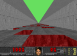          |
| Arms Dealer      | Weapons Delivered | Collect weapons and deliver them to the appearing platforms.                               | 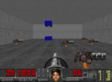      |
| Hide and Seek    | Frames Alive      | Escape and hide from enemies to survive as long as possible.                               |     |
| Floor is Lava    | Frames Alive      | Keep off the laval by staying on platform tiles which priodically switch locations.        | 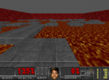    |
| Chainsaw         | Kill Count        | Find and eliminate stationary enemies at close range distance in a maze.                   | 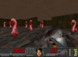         |
| Raise the Roof   | Frames Alive      | Activate switches on walls to slightly raise a lowering ceiling and prevent being crushed. | 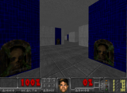   |
| Run and Gun      | Kill Count        | Find and eliminate targets by shooting them with a pistol.                                 | 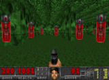      |
| Health Gathering | Frames Alive      | Pick up health kits to survive in an environment with an acid surface.                     | 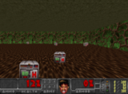 |

### Task Sequences
COOM combines the environments of scenarios into sequences of tasks for Continual Learning. 
The sequence length varies between 4, 8, and 16. 
COOM provides two types of task sequences in two levels of difficulty.

#### Cross-Domain
The Cross-Domain sequence composes modified versions the same scenario (e.g., changing textures, enemy types, view height, and adding obstacles), 
while keeping the objective consistent. The `Run and Gun` scenario serves as the basis for this sequence type.

#### Cross-Objective
Contrasts with Cross-Domain by changing both the visual characteristics and the objective for each task, 
requiring a more general policy from the agent for adequate performance. 

### Quick Start
COOM integrates with the Gymnasium API and is available through PyPi with `pip install COOM`. 
After installation, you can create an environment using the `make_env` function 
or a sequence of environments by instantiating the `ContinualLearningEnv` class:

```python
from COOM.env.builder import make_env
from COOM.env.continual import ContinualLearningEnv
from COOM.utils.config import Scenario, Sequence

env = make_env(Scenario.RAISE_THE_ROOF)
cl_env = ContinualLearningEnv(Sequence.CO8)
```